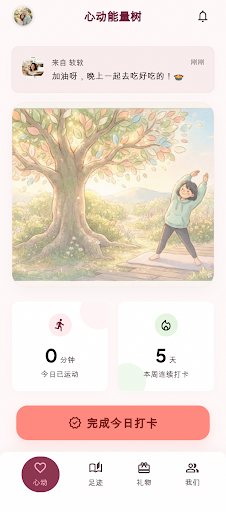
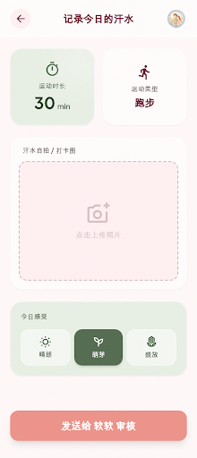
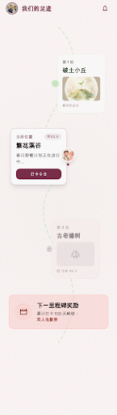
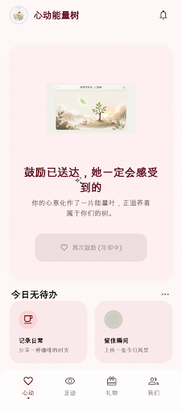
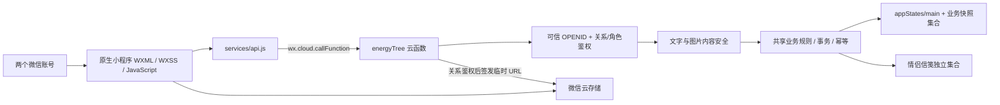

# 心动能量树微信小程序（私人版 V2）

这是一个原生微信小程序，用来实现“情侣运动陪伴 + 运动打卡 + 赞助者审核 + 能量币/余额记账 + 心愿金领取/手动兑现 + 能量树 + 探险地图 + 奖励商店 + 徽章统计”。私人版 V2 还包含鼓励卡、共同里程碑、每周回顾、恋爱主题 UI，以及可降级的庆祝动效。

## 当前交付状态

- 客户端与云函数 buildTag 统一为 `heart-tree-private-v2-20260713-release-safety-v2`。
- `npm test` 当前覆盖 203 项业务、权限、并发、内容安全、UI 和动效契约测试。
- `npm run check:shared` 用于确保客户端主版与云函数部署副本无漂移。
- 图片内容安全已实现 `traceId 登记 -> wxa_media_check 回调 -> 风险图隐藏/删除 -> 审计记录` 的代码闭环；微信平台消息推送路由和真机风险图验证仍需按 [`docs/content-safety-closed-loop.md`](docs/content-safety-closed-loop.md) 人工完成。
- 公开仓库只保留可复现源码、虚构演示数据和经过筛选的界面素材；不收录开发者工具私有配置、云端验证日志、账号素材、本地依赖、二维码和渲染缓存。

## 界面展示

以下画面使用虚构情侣资料，是当前界面设计与实现基线，不包含真实 OPENID、邀请 token、二维码或私人照片。

| 打卡者首页 | 运动打卡 | 探险地图 | 奖励商店 |
| --- | --- | --- | --- |
|  |  |  |  |

### 赞助者陪伴首页



## 架构概览



完整的可信身份边界、打卡入账事务、情侣信笺、图片异步安全闭环和共享代码防漂移机制见 [架构说明](docs/architecture.md)。

## 运行

1. 用微信开发者工具导入仓库根目录
2. `project.config.json` 已配置 AppID：`wxce9c3ccdb34edd43`
3. `miniprogram/config/env.js` 已配置云环境：`cloud1-d4g55gq4eabcd1b77`，云函数名：`energyTree`
4. 当前 `apiMode` 为 `cloud`，小程序端会强制调用云函数；需要本地 demo 时再临时改为 `local`
5. 每次修改 `cloudfunctions/energyTree` 后，在微信开发者工具右键该云函数，选择“上传并部署：云端安装依赖（不上传 node_modules）”
6. 部署后重新编译并真实调用 `queryDashboard`，云端响应的 `buildTag` 应为 `heart-tree-private-v2-20260713-release-safety-v2`；如果仍是旧版本，说明云函数还没更新成功

## 私人版 V2 体验

- 首页按角色展示情侣陪伴总览、能量树、今日行动和待办事项。
- 赞助者可以发送鼓励卡；接收方可查看并标记已读。
- 共同里程碑覆盖首次打卡、连续天数、地图通关、徽章、兑换和心愿金完成等场景，并为双方分别记录已读状态。
- 每周回顾按中国时区的周一至周日统计双方进展，不展示打卡照片。
- 所有关键提交、审核、核销、退款、心愿金和奖品管理操作都有请求幂等与客户端进行中锁。
- 现有绑定、打卡、账本和审核历史会原样保留，不需要清库或重新绑定。

## Image 2 图片资产

- Image 2 原始输出保存在 `design/imagegen-source/`，用于保留生成成果和后续重新处理。
- 小程序实际使用的透明装饰图位于 `miniprogram/assets/generated/`。原始输出如果带有棋盘格预览背景，在 macOS（需系统 Swift + Vision，以及 Python Pillow）运行 `python3 scripts/clean-generated-cutouts.py`，可通过本地前景分割重新生成真实 RGBA 透明图，并同步情侣角色图到 `motion-studio/public/characters/`；处理过程不上传图片。
- 清理角色图后运行 `npm --prefix motion-studio run render:posters`，重新导出 13 张不含棋盘格的本地动效 poster。
- 地图和商店横幅是完整矩形 JPG，不参与透明背景清理。

## Remotion 动效素材工厂

`motion-studio/` 是独立的离线预渲染工程，只负责把 React/Remotion 场景导出为 MP4、单帧和 poster；它不会被打包进小程序，也不会在 WXML 运行时执行 React 或 Remotion。

首次使用先安装精确锁定的依赖：

```bash
cd motion-studio
npm ci
```

常用命令：

```bash
npm run compositions
npm run render:smoke
npm run render:preview
npm run render:posters
```

- `npm run compositions`：发现 13 个视频 composition 和 13 个 poster still。
- `npm run render:smoke`：渲染 `motion-studio/out/smoke/binding-frame.png`。
- `npm run render:preview`：渲染 `motion-studio/out/previews/approval.mp4`。
- `npm run render:posters`：把 13 张压缩 poster 写入 `miniprogram/assets/motion/`。
- 当前 13 张 poster 合计 `108,503` 字节，低于本项目为 V2 新增动效素材设置的 `409,600` 字节预算。

小程序动效采用三级降级：

1. `miniprogram/config/motion-assets.js` 中存在可访问的 `videoSrc` 时，优先播放远程 MP4；`cloud://` 文件 ID 会先换取临时 URL。
2. 视频未配置、不可访问或播放失败时，展示打包在小程序内的本地 poster。
3. poster 也加载失败时，展示 300–600ms 的原生 WXML/WXSS hearts、ribbon 或 coins 动效。

当前远程视频增强有意保持关闭，所有 `videoSrc` 都是空字符串，因此默认稳定展示本地 poster。以后把 MP4 上传到云存储后，只需把对应文件 ID 填入 `miniprogram/config/motion-assets.js` 的 `videoSrc`；清单中的 `cloudPath` 是建议上传路径，不代表文件已经上传。

## 第一版心愿金流

- 小程序只做余额记账、心愿金领取申请和状态流转
- 赞助者需要在线下手动兑现
- 兑现后回到“心愿金处理”页点击“我已手动兑现”
- 第一版不接入平台付款接口，也不提供金融服务

## 主要页面

- 首页：女友端展示能量树、今日打卡、地图和商店；男友端直接展示守护总览、待审核、心愿金处理、女友信息和规则/商店管理入口
- 能量大冒险：横向关卡地图、当前关卡进度和通关奖励
- 奖励商店：按分类浏览奖励，使用能量币兑换兑换券
- 我的：女友端展示统计、打卡日历、徽章墙、心愿金领取和兑换记录；男友端保留女友信息与管理入口，但不再作为守护后台主入口
- 今日打卡：上传照片，提交待审核记录；提交后先展示待确认能量币
- 男友管理：审核台、奖励规则/地图奖励、心愿金处理、奖品管理、兑换核销

## 后端替换边界

页面调用统一经过 `miniprogram/services/api.js`。接入云函数、自建服务或微信商家转账时，优先替换这一层；详细契约见 `docs/api-contract.md`。

当前 `cloudfunctions/energyTree` 已作为可信云端 API 层：云函数从微信环境获取 `OPENID`，加载云数据库状态，执行业务规则后写回云数据库，并同步集合快照。部署前必须由你在云开发控制台创建环境、部署云函数，并确认数据库权限规则禁止小程序端直接写入。

## 绑定与部署

- 未绑定用户会进入“绑定运动能量树”页
- 第一位进入的人点击“创建并成为发起者”，成为赞助者
- 赞助者在“我的”页点击“分享邀请卡片”，通过微信小程序分享邀请另一半加入
- 另一半从分享卡片进入后直接绑定为打卡者，不需要手动输入邀请码
- 打卡照片会先上传到云存储，再把 `fileID` 提交给云函数
- 需要在微信公众平台配置隐私保护指引，说明会使用相册/相机照片用于运动打卡审核

## 合并版规则

- 提交打卡只产生待确认奖励，不直接增加可领取心愿金
- 审核通过是正式入账、地图前进、徽章解锁和彩蛋记录的唯一入口，并且只能由赞助者 openid 执行
- 被退回不会惩罚连续记录，当天可以重新提交一张清晰照片
- `1 能量币 = 1 元`，底层仍用 cents 存储，商店兑换和心愿金领取共用同一套余额
- 探险地图默认总长 45 天，默认关卡为 5/7/9/11/13 天；赞助者可在规则页调整关卡天数和奖励，但总天数不能超过 45 天
- 随机惊喜只包含非现金内容，现金奖励来自固定规则、连续打卡和关卡通关
- 最终关卡通关奖励只发一次，后续继续打卡只累计额外步数
- 心愿金标记已兑现、心愿金退回、兑换核销、兑换取消退款都要求二次确认和备注
- 兑换取消采用“打卡者申请取消，赞助者确认退款或拒绝”的流程

## 权限边界

- 生产逻辑必须以云函数侧 openid 为准，不信任前端传入的 `role`、`userId`、`sponsorId` 或 `openid`
- 本地 `switchRole` 只用于 demo 体验，不可作为上线权限判断
- 高权限操作包括：审核打卡、修改奖励规则、处理心愿金、核销兑换、管理奖品、确认兑换退款
- 所有高权限/资金状态变更都会写入 `auditLogs`

## 测试

业务、权限、幂等、日期、UI、窄屏和动效契约：

```bash
npm test
```

客户端与云函数共享业务代码一致性：

```bash
npm run check:shared
```

JavaScript 语法（排除依赖目录）：

```bash
for file in $(find miniprogram cloudfunctions scripts motion-studio \
  -type d -name node_modules -prune -o -type f -name '*.js' -print); do
  node --check "$file"
done
```

Remotion 的 JSX 由 `npm run compositions` 和渲染命令通过实际 bundling 校验；不要用 `node --check` 直接解析 `.jsx`。

## 微信开发者工具最终验证

本地自动化通过后仍需人工完成以下步骤，不能以本地日志替代云端或双账号证据：

1. 用微信开发者工具打开项目，点击“编译”，记录 Problems、Errors 和 Warnings。
2. 右键 `energyTree`，选择“上传并部署：云端安装依赖（不上传 node_modules）”。
3. 部署后重新编译，并从控制台真实调用 `queryDashboard`。
4. 确认云端响应的 `buildTag` 与 `miniprogram/config/env.js` 完全一致；客户端启动日志不能证明云函数已部署。
5. 使用现有两个微信账号验证打卡、审核、奖励、地图、里程碑、鼓励、商店、心愿金、每周回顾、poster/原生降级和声音开关。
6. 不清库、不重建绑定，不在验收材料中保存 openid、邀请 token、二维码、头像或照片。

## 已接受限制与上线边界

- 跨账号头像、聊天图片和打卡照片由云函数在关系鉴权后通过服务端 `getTempFileURL` 签发临时访问地址，不依赖公共读规则。
- 远程 Remotion MP4 增强尚未启用；本地 poster 和原生动画是当前正式降级路径。
- 心愿金只做记账、申请、审批和“模拟/手动兑现”状态流，不接真实支付。
- 本项目当前只按固定情侣关系做私人版验收。公开上线仍需完成多情侣数据隔离、服务端文件授权、规则版本化、并发规模验证和隐私合规加固。
