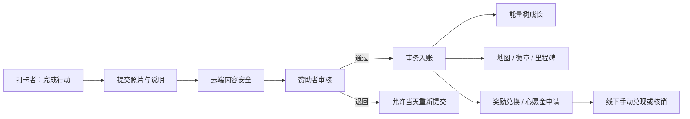
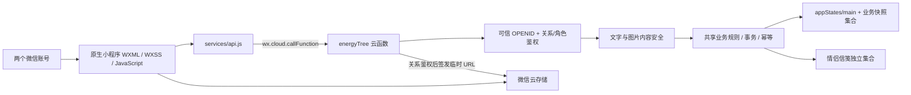

<p align="center">
  
</p>

<h1 align="center">心动能量树微信小程序 · 私人版 V3 UI</h1>

<p align="center">
  把运动打卡、陪伴反馈和线下承诺，做成只属于两个人的一座共同花园。
</p>

<p align="center">
  <a href="https://github.com/728792899-create/heart-energy-tree-miniprogram/actions/workflows/ci.yml"></a>
  
  
  
  
  <a href="LICENSE"></a>
</p>

这是一个原生微信小程序，用来实现“情侣运动陪伴 + 运动打卡 + 赞助者审核 + 能量币记账 + 心愿金申请/手动兑现 + 能量树 + 探险地图 + 奖励商店 + 徽章统计”。私人版 V3 UI 采用晨雾植物志设计系统，并保留情侣信笺、鼓励卡、共同里程碑、每周回顾及可以逐级降级的庆祝动效。

它不是健身平台、社交产品、支付工具或金融产品。它只服务于一段固定的两人关系：一方完成行动，另一方给予反馈，共同维护一份可解释、可恢复、有边界的私人记录。

## 快速导航

| 想了解什么 | 从这里开始 |
| --- | --- |
| 浏览全部公开文档 | [文档中心](docs/README.md) · [常见问题](docs/faq.md) |
| 先看产品长什么样 | [完整产品导览](docs/product-tour.md) · [22 个页面目录](docs/page-catalog.md) · [V3 视觉展示](#v3-视觉展示) |
| 查看 V3 高保真原型 | [Figma 全量原型](https://www.figma.com/design/8jtVG6uk2Z45OhUXbqLHHX) · [47 张画板与原创素材说明](design/prototype-v3/README.md) |
| 了解视觉语言和素材来源 | [视觉与动效设计说明](docs/visual-language.md) |
| 了解可信身份、事务和数据流 | [架构说明](docs/architecture.md) · [API 契约](docs/api-contract.md) |
| 本地运行、测试和构建 | [运行](#运行) · [测试](#测试) · [Remotion 动效工厂](#remotion-动效素材工厂) |
| 部署云函数和数据库 | [部署清单](docs/deployment-checklist.md) · [数据运维](docs/data-operations.md) |
| 隐私、删除和账号恢复 | [隐私与数据生命周期](docs/privacy-data-lifecycle.md) · [安全策略](SECURITY.md) |
| 发布前逐项验收 | [真机验收表](docs/device-acceptance.md) · [Release Checklist](docs/release-checklist.md) |

## 两个人如何一起使用

| 打卡者 | 赞助者 | 共同结果 |
| --- | --- | --- |
| 上传运动照片、填写时长与备注 | 审核或退回打卡 | 审核通过后才正式入账 |
| 查看能量树、地图、徽章和余额 | 配置规则、奖品和关卡奖励 | 所有高风险操作有角色鉴权与审计 |
| 兑换奖励、申请取消、申请心愿金 | 核销奖励、确认退款、线下兑现后标记 | 不接真实支付，资金状态保持可解释 |
| 发送信笺、图片、贴纸和请求卡 | 发送鼓励、回应请求、查看陪伴数据 | 双方各自维护已读状态和共同里程碑 |


## 关键能力矩阵

| 能力 | 打卡者 | 赞助者 | 可信边界 |
| --- | --- | --- | --- |
| 运动打卡 | 上传照片、时长和备注 | 审核或退回 | 云端文字/图片安全检查，审核通过才事务入账 |
| 能量树与地图 | 查看成长和关卡 | 配置固定关卡奖励 | 只消费已审核记录，不接受客户端直接改进度 |
| 奖励商店 | 兑换、申请取消 | 核销、确认退款、维护奖品 | 幂等请求、事务扣减、审计记录 |
| 心愿金 | 提交领取申请 | 审批并在线下兑现 | 不接真实支付，不自动转账 |
| 情侣信笺 | 发送文字、授权图片、贴纸和请求 | 同等发送与回应 | 可信 OPENID、关系目录、独立未读投影 |
| 每周回顾 | 查看双方一周成果 | 查看陪伴摘要 | 中国时区统计，不复制打卡照片 |
| 关系解除 | 阅读两次警告并发起或确认 | 同样由另一方独立确认 | 双方确认才冻结；单方不能解除；历史数据不自动删除 |



## 当前交付状态

| 项目 | 当前状态 |
| --- | --- |
| 产品与界面 | 私人版 V3「晨雾植物志」；源码候选版本 `3.1.0` |
| GitHub 基线 | 当前分支包含双方确认解除关系；合入 `main` 与公开 CI 状态以仓库 Actions 为准 |
| 线上云函数 | `3.0.0` 对应 `energyTree` 已部署，真实 `queryDashboard` 调用通过 |
| 线上微信版本 | `3.0.0` 已于 2026-07-23 13:09:40 正式发布（依据管理员提供的平台截图） |
| 下一候选 | `3.1.0` 增加双方确认、两次警告的关系解除入口；尚未部署、上传、提审或发布 |

`3.1.0` 是候选版本，不是当前线上版本；完成隔离云环境双账号验收前不得发布。

- `3.1.0` 继续使用兼容协议 buildTag `heart-tree-private-v2-20260717-release-final-v1`，同时要求云端返回发布能力标识 `heart-tree-private-v3-20260723-unbind-consent-v1`。这样先部署向后兼容云函数时，已上线 `3.0.0` 不会因 tag 改变而中断；新客户端又不会误连缺少解除能力的旧云函数。
- `npm test` 当前覆盖 239 项业务、权限、并发、内容安全、UI、运维文档、设计工具和动效契约测试；公开仓库全新克隆不需要私有配置或渲染缓存。
- `npm run check:shared` 用于确保客户端主版与云函数部署副本无漂移。
- [GitHub Actions](.github/workflows/ci.yml) 在无微信账号环境运行普通质量检查、云函数干净安装，以及独立的 Remotion compositions/still smoke。
- 图片内容安全已实现 `traceId 登记 -> wxa_media_check 回调 -> 风险图隐藏/删除 -> 审计记录` 的代码闭环；微信平台消息推送路由和真机风险图验证仍需按 [`docs/content-safety-closed-loop.md`](docs/content-safety-closed-loop.md) 人工完成。
- 公开仓库只保留可复现源码、虚构演示数据和经过筛选的界面素材；不收录开发者工具私有配置、云端验证日志、账号素材、本地依赖、二维码和渲染缓存。

## V3 视觉展示

以下内容来自已验收的 V3「晨雾植物志」原创设计源，不含文字、真人、OPENID、邀请 token、二维码或私人照片。它们用于说明最新视觉方向，不冒充微信开发者工具截图或双账号真机证据；47 张高保真业务画板见 [Figma 全量原型](https://www.figma.com/design/8jtVG6uk2Z45OhUXbqLHHX)。

旧版粉色模拟器截图和熊兔营销插画已经从当前文档移除。新的 V3 脱敏开发者工具截图只有在使用虚构 fixture 重新采集后才会加入。

| 私人花园 | 健康行动 | 地图旅程 | 礼物兑现 |
| --- | --- | --- | --- |
|  |  |  |  |

### 抽象双人关系

| 建立关系 | 共同成长 | 完成庆祝 |
| --- | --- | --- |
|  |  |  |

### 五阶段能量树

| 破土 | 发芽 | 成长 | 盛放 | 心愿花园 |
| --- | --- | --- | --- | --- |
|  |  |  |  |  |

## 架构概览



完整的可信身份边界、打卡入账事务、情侣信笺、图片异步安全闭环和共享代码防漂移机制见 [架构说明](docs/architecture.md)。

## 运行

1. 用微信开发者工具导入仓库根目录
2. `project.config.json` 已配置 AppID：`wxce9c3ccdb34edd43`
3. 公开配置已经固定 `ignoreDevUnusedFiles=false`；如需本地私有覆盖，可从 `project.private.config.example.json` 复制并保持实际 `project.private.config.json` 不提交
4. `miniprogram/config/env.js` 已配置云环境：`cloud1-d4g55gq4eabcd1b77`，云函数名：`energyTree`
5. 当前 `apiMode` 为 `cloud`，小程序端会强制调用云函数；需要本地 demo 时再临时改为 `local`
6. 每次修改 `cloudfunctions/energyTree` 后，在微信开发者工具右键该云函数，选择“上传并部署：云端安装依赖（不上传 node_modules）”
7. 部署后重新编译并真实调用 `queryDashboard`：`buildTag` 应为 `heart-tree-private-v2-20260717-release-final-v1`，`releaseTag` 应为 `heart-tree-private-v3-20260723-unbind-consent-v1`；缺少后者表示仍是旧云函数

## 私人版 V3 体验

- 首页按角色展示情侣陪伴总览、能量树、今日行动和待办事项。
- 赞助者可以发送鼓励卡；接收方可查看并标记已读。
- 共同里程碑覆盖首次打卡、连续天数、地图通关、徽章、兑换和心愿金完成等场景，并为双方分别记录已读状态。
- 每周回顾按中国时区的周一至周日统计双方进展，不展示打卡照片。
- 所有关键提交、审核、核销、退款、心愿金和奖品管理操作都有请求幂等与客户端进行中锁。
- “我的 → 关系与隐私”提供关系解除：发起方和确认方各自阅读两次警告；待确认阶段不改变当前关系，只有另一方确认后才短暂锁定写入、清除双方绑定并冻结旧关系。
- 现有绑定、打卡、账本和审核历史会原样保留，不需要清库或重新绑定。

## ImageGen 图片资产

- V3 当前设计源位于 `design/prototype-v3/assets/`：5 张连续成长树、3 张抽象双人关系场景和 4 张业务场景，统一使用象牙白、鼠尾草绿与陶土色，不再使用熊兔作为主视觉。
- `design/imagegen-source/`、`miniprogram/assets/generated/` 与 `miniprogram/assets/motion/` 中仍包含线上 `3.0.0` 正在使用的运行时兼容素材；它们不再作为 README 的 V3 展示图。
- 替换运行时树木或 poster 会改变线上包，必须作为后续版本单独实现、重新跑包体和三级降级测试并重新提审，不能直接删除。

## Remotion 动效素材工厂

`motion-studio/` 是独立的离线预渲染工程，只负责把 React/Remotion 场景导出为 MP4、单帧和 poster；它不会被打包进小程序，也不会在 WXML 运行时执行 React 或 Remotion。

首次使用先安装精确锁定的依赖：

```bash
npm ci --prefix motion-studio --ignore-scripts
```

常用命令：

```bash
npm run motion:compositions
npm run motion:smoke
npm run motion:preview
npm run motion:posters
```

- `npm run motion:compositions`：发现 13 个视频 composition 和 13 个 poster still。
- `npm run motion:smoke`：渲染 `motion-studio/out/smoke/binding-frame.png`，与普通 `npm test` 独立。
- `npm run motion:preview`：渲染 `motion-studio/out/previews/approval.mp4`。
- `npm run motion:posters`：把 13 张压缩 poster 写入 `miniprogram/assets/motion/`。
- `motion-studio/out/` 和 `.cache/` 始终忽略；普通测试只校验可提交入口与 poster，不依赖这些生成物。
- 当前审核包的 13 张兼容 poster 合计 `108,503` 字节，低于 `409,600` 字节预算；公开 V3 图文展示不再引用这些旧 poster。

小程序动效采用三级降级：

1. `miniprogram/config/motion-assets.js` 中存在可访问的 `videoSrc` 时，优先播放远程 MP4；`cloud://` 文件 ID 会先换取临时 URL。
2. 视频未配置、不可访问或播放失败时，展示打包在小程序内的本地 poster。
3. poster 也加载失败时，展示 300–600ms 的原生 WXML/WXSS hearts、ribbon 或 coins 动效。

当前远程视频增强有意保持关闭，所有 `videoSrc` 都是空字符串，因此默认稳定展示本地 poster。以后把 MP4 上传到云存储后，只需把对应文件 ID 填入 `miniprogram/config/motion-assets.js` 的 `videoSrc`；清单中的 `cloudPath` 是建议上传路径，不代表文件已经上传。

“我的”页提供持久化的声音和“简化动效”开关。简化动效开启时跳过远程视频并保留静态 poster；poster 失败仍有静止可读的原生兜底。

## 心愿金手动兑现流程

- 小程序只做余额记账、心愿金领取申请和状态流转
- 赞助者需要在线下手动兑现
- 兑现后回到“心愿金处理”页点击“我已手动兑现”
- 当前线上 `3.0.0` 与候选 `3.1.0` 都不接入平台付款接口，也不提供金融服务

## 主要页面

- 首页：女友端展示能量树、今日打卡、地图和商店；男友端直接展示守护总览、待审核、心愿金处理、女友信息和规则/商店管理入口
- 能量大冒险：横向关卡地图、当前关卡进度和通关奖励
- 奖励商店：按分类浏览奖励，使用能量币兑换兑换券
- 我的：女友端展示统计、打卡日历、徽章墙、心愿金领取和兑换记录；男友端保留女友信息与管理入口，但不再作为守护后台主入口
- 今日打卡：上传照片，提交待审核记录；提交后先展示待确认能量币
- 男友管理：审核台、奖励规则/地图奖励、心愿金处理、奖品管理、兑换核销

## 后端替换边界

页面调用统一经过 `miniprogram/services/api.js`。当前生产实现只接入可信云函数；如未来替换为自建服务，应优先替换这一层并重新完成安全审查。详细契约见 `docs/api-contract.md`。

当前 `cloudfunctions/energyTree` 已作为可信云端 API 层：云函数从微信环境获取 `OPENID`，加载云数据库状态，执行业务规则后写回云数据库，并同步集合快照。部署前必须由你在云开发控制台创建环境、部署云函数，并确认数据库权限规则禁止小程序端直接写入。

数据库集合、索引、规则、备份、恢复和 version 4 迁移见 [`docs/data-operations.md`](docs/data-operations.md) 与 [`docs/cloud-database.rules.json`](docs/cloud-database.rules.json)。双方确认的关系解除入口以及数据导出、删除、照片生命周期、隐私授权撤回和异常账号恢复见 [`docs/privacy-data-lifecycle.md`](docs/privacy-data-lifecycle.md)。其中只有“保留数据并解除访问”在 `3.1.0` 自动化；数据导出、永久删除和账号恢复仍是人工高风险流程。

## 绑定与部署

- 未绑定用户会进入“绑定运动能量树”页
- 第一位进入的人点击“创建并成为发起者”，成为赞助者
- 赞助者在“我的”页点击“分享邀请卡片”，通过微信小程序分享邀请另一半加入
- 另一半从分享卡片进入后直接绑定为打卡者，不需要手动输入邀请码
- 打卡照片会先上传到云存储，再把 `fileID` 提交给云函数
- 需要在微信公众平台配置隐私保护指引，说明会使用相册/相机照片用于运动打卡审核

## 合并版规则

- 提交打卡只产生待确认奖励，不直接增加可领取心愿金
- 审核通过是正式入账、地图前进、徽章解锁和彩蛋记录的唯一入口，并且只能由赞助者 openid 执行
- 被退回不会惩罚连续记录，当天可以重新提交一张清晰照片
- `1 能量币 = 1 元`，底层仍用 cents 存储，商店兑换和心愿金领取共用同一套余额
- 探险地图默认总长 45 天，默认关卡为 5/7/9/11/13 天；赞助者可在规则页调整关卡天数和奖励，但总天数不能超过 45 天
- 随机惊喜只包含非现金内容，现金奖励来自固定规则、连续打卡和关卡通关
- 最终关卡通关奖励只发一次，后续继续打卡只累计额外步数
- 心愿金标记已兑现、心愿金退回、兑换核销、兑换取消退款都要求二次确认和备注
- 兑换取消采用“打卡者申请取消，赞助者确认退款或拒绝”的流程

## 权限边界

- 生产逻辑必须以云函数侧 openid 为准，不信任前端传入的 `role`、`userId`、`sponsorId` 或 `openid`
- 本地 `switchRole` 只用于 demo 体验，不可作为上线权限判断
- 高权限操作包括：审核打卡、修改奖励规则、处理心愿金、核销兑换、管理奖品、确认兑换退款
- 所有高权限/资金状态变更都会写入 `auditLogs`

## 测试

业务、权限、幂等、日期、UI、窄屏和动效契约：

```bash
npm test
```

客户端与云函数共享业务代码一致性：

```bash
npm run check:shared
```

完整公开 CI 检查：

```bash
npm run ci
```

等价的独立检查包括：

```bash
npm run check:syntax
npm run check:cloud-deps
npm run check:budgets
npm run check:docs
```

JavaScript 语法（排除依赖目录）：

```bash
for file in $(find miniprogram cloudfunctions scripts motion-studio \
  -type d -name node_modules -prune -o -type f -name '*.js' -print); do
  node --check "$file"
done
```

Remotion 的 JSX 由 `npm run motion:compositions` 和 `npm run motion:smoke` 通过实际 bundling 校验；不要用 `node --check` 直接解析 `.jsx`。

## 微信开发者工具最终验证

本地自动化通过后仍需人工完成以下步骤，不能以本地日志替代云端或双账号证据：

逐项步骤和脱敏证据要求见 [`docs/deployment-checklist.md`](docs/deployment-checklist.md)、[`docs/device-acceptance.md`](docs/device-acceptance.md) 和 [`docs/release-checklist.md`](docs/release-checklist.md)。

1. 用微信开发者工具打开项目，点击“编译”，记录 Problems、Errors 和 Warnings。
2. 右键 `energyTree`，选择“上传并部署：云端安装依赖（不上传 node_modules）”。
3. 部署后重新编译，并从控制台真实调用 `queryDashboard`。
4. 确认云端响应的 `buildTag` 与 `releaseTag` 都与 `miniprogram/config/env.js` 完全一致；客户端启动日志不能证明云函数已部署。
5. 使用隔离测试环境的两个账号验证打卡、审核、奖励、地图、里程碑、鼓励、商店、心愿金、每周回顾、双方关系解除、poster/原生降级和声音开关；不要在现有线上私人关系执行最终解除。
6. 不清库、不重建绑定，不在验收材料中保存 openid、邀请 token、二维码、头像或照片。

## 已接受限制与上线边界

- 跨账号头像、聊天图片和打卡照片由云函数在关系鉴权后通过服务端 `getTempFileURL` 签发临时访问地址，不依赖公共读规则。
- 远程 Remotion MP4 增强尚未启用；本地 poster 和原生动画是当前正式降级路径。
- 心愿金只做记账、申请、审批和“模拟/手动兑现”状态流，不接真实支付。
- 本项目只按固定两人关系做私人版发布，不包含公共注册、租户选择、陌生人匹配或多租户改造。若未来需求改变，必须另行立项，不能在本私人版发布中隐式扩展。

## 许可证与安全

仓库采用 [ISC License](LICENSE)。安全报告与已知依赖边界见 [SECURITY.md](SECURITY.md)；请勿在公开 issue 中粘贴秘密或私人数据。
