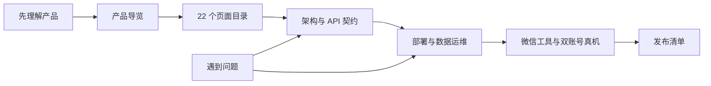

# 心动能量树文档中心

这里是公开仓库的统一文档入口。产品说明、工程实现、云端部署和人工验收被分开记录，避免把“代码已经实现”“自动化已经验证”和“微信平台已经验收”混成同一件事。

> 项目始终是固定两人私人版：不扩展公共多租户，不接真实支付，不把能量币描述成金融产品。

## 按阅读目标开始

| 你的目标 | 建议顺序 | 能得到什么 |
| --- | --- | --- |
| 第一次了解产品 | [产品导览](product-tour.md) → [页面目录](page-catalog.md) | 两个角色怎样协作、主要页面和完整截图 |
| 准备本地运行 | [README 运行说明](../README.md#运行) → [常见问题](faq.md) | 公开配置、依赖、测试和常见报错 |
| 准备部署 | [架构说明](architecture.md) → [部署清单](deployment-checklist.md) → [数据运维](data-operations.md) | 云函数、数据库、buildTag、备份和回滚 |
| 安全与隐私 | [内容安全闭环](content-safety-closed-loop.md) → [隐私与数据生命周期](privacy-data-lifecycle.md) → [安全策略](../SECURITY.md) | OPENID、图片审核、删除和账号恢复边界 |
| 发布验收 | [真机验收表](device-acceptance.md) → [Release Checklist](release-checklist.md) | 开发者工具、双账号真机和发布证据要求 |

## 产品与视觉

| 文档 | 内容 |
| --- | --- |
| [产品导览](product-tour.md) | 打卡者、赞助者、共同成长、信笺、周报、动效和异常状态 |
| [页面目录](page-catalog.md) | `app.json` 中全部 22 个页面的角色、入口、职责和数据边界 |
| [视觉与动效设计说明](visual-language.md) | 色彩、角色、树木、声音、reduced-motion 和素材生产链 |

## 工程与接口

| 文档 | 内容 |
| --- | --- |
| [架构说明](architecture.md) | 可信身份、事务、情侣信笺、内容安全和共享代码防漂移 |
| [API 契约](api-contract.md) | 页面与服务层动作、请求/响应语义和业务不变量 |
| [情侣信笺部署](couple-messages-deployment.md) | 信笺集合、索引、实时监听和兼容迁移 |

## 云端、安全与运维

| 文档 | 内容 |
| --- | --- |
| [部署清单](deployment-checklist.md) | 编译、云函数部署、buildTag 核对和回滚门槛 |
| [数据运维](data-operations.md) | 集合、索引、权限、备份、恢复和版本迁移 |
| [内容安全闭环](content-safety-closed-loop.md) | 文字检查、图片异步回调、风险内容处置和证据要求 |
| [隐私与数据生命周期](privacy-data-lifecycle.md) | 解绑、导出、删除、照片生命周期、撤回授权和账号恢复 |

## 验收与发布

| 文档 | 内容 |
| --- | --- |
| [真机验收表](device-acceptance.md) | 开发者工具、窄屏、键盘、弱网和双账号协作证据 |
| [Release Checklist](release-checklist.md) | 代码、安全、内容、产品边界与外部权限核对 |
| [常见问题](faq.md) | 使用、部署、安全、动效、数据和 CI 排障 |

## 证据标签

| 标签 | 含义 |
| --- | --- |
| 自动化通过 | 本地或 GitHub Actions 可以重复执行并得到相同结论 |
| 开发者工具模拟器 | 原生 WXML/WXSS 页面已经在微信开发者工具中渲染，但不等于真机通过 |
| 人工待验收 | 需要合法微信登录、云环境权限或两个真实账号才能完成 |
| 外部权限阻塞 | 当前没有对应平台权限，步骤未执行且不得伪造证据 |

公开截图全部使用虚构演示数据。模拟器截图只能证明页面形态，不证明云函数已经部署、内容安全回调已经送达或双账号真机流程已经通过。
