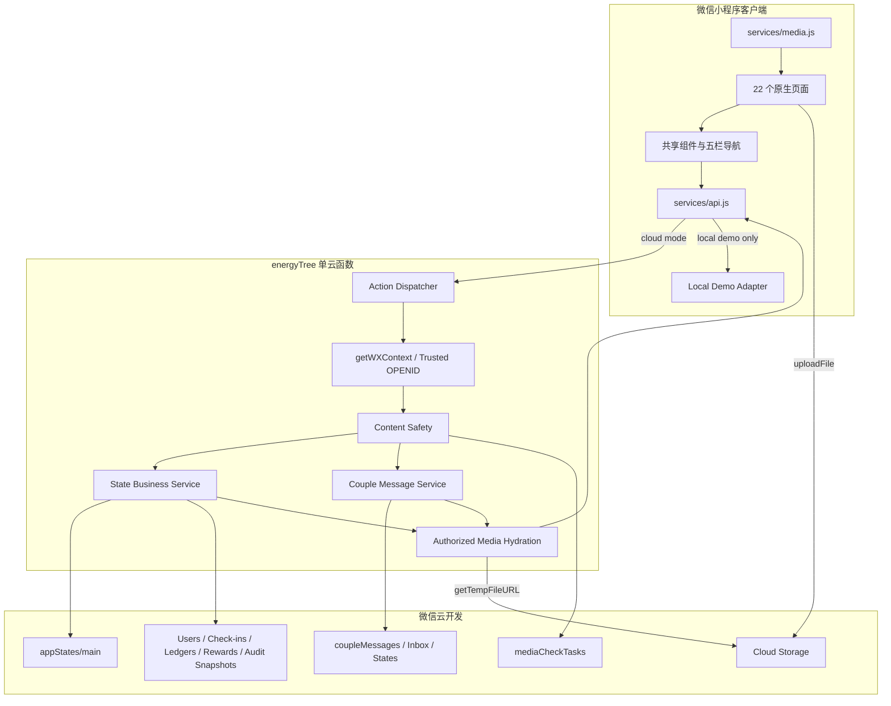
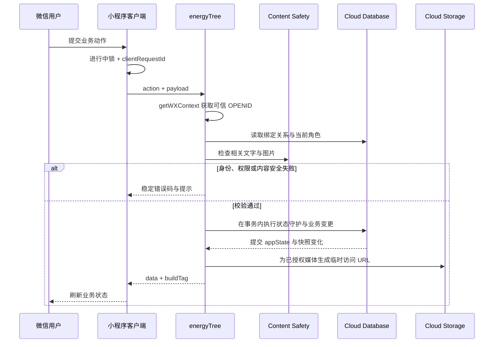
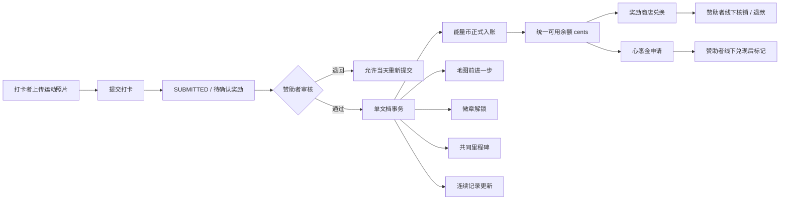
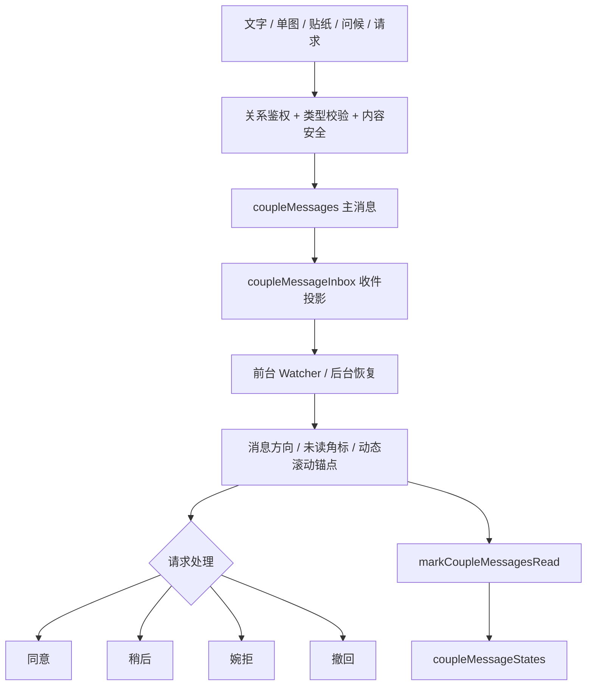
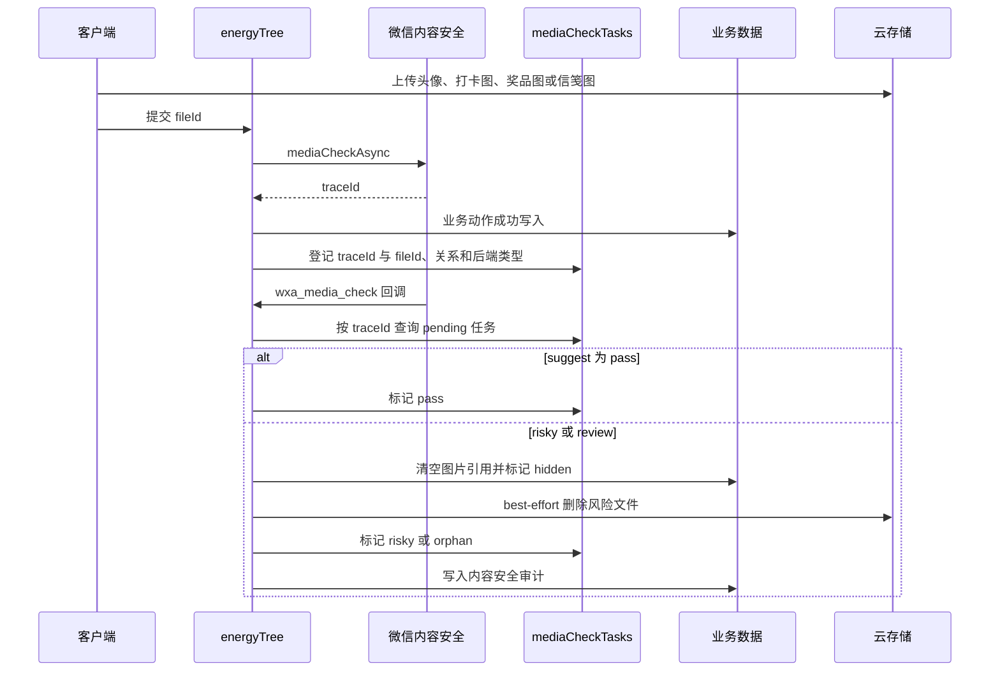
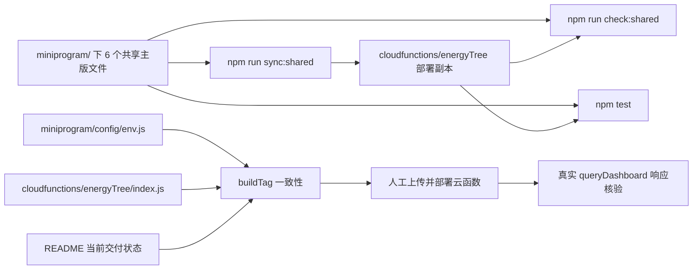

# 心动能量树架构说明

## 1. 客户端、云函数与数据层

生产模式下，客户端只提交动作与业务参数。角色、用户和关系归属由云函数使用微信环境提供的 OPENID 解析，不能信任客户端传入的 `role`、`userId`、`sponsorId` 或 `openid`。

## 2. 授权动作处理时序

查询与变更使用同一 API 边界。高权限动作还会校验赞助者角色；资金状态、审核、退款、核销和规则管理等变化写入 `auditLogs`。

## 3. 运动打卡、奖励与心愿金事务

审核通过是入账、地图、徽章和里程碑生效的唯一入口。商店与心愿金共用同一余额，但系统不接充值、自动付款或微信支付；`1 能量币 = 1 元` 只是产品展示规则，底层始终使用 cents 记账。

## 4. 情侣信笺与实时状态

自定义情侣请求保留“邀请不代表同意，双方都可以拒绝或改变主意”的同意提示。消息集合与 `appStates/main` 分离，避免实时信笺读写和核心业务单文档事务互相耦合。

## 5. 图片内容安全异步闭环

回调代码已经实现，但正式闭环仍依赖微信公众平台把 `wxa_media_check` 结果路由到 `energyTree`，并完成真机风险图验证。详见 [`content-safety-closed-loop.md`](content-safety-closed-loop.md)。

## 6. 共享代码、防漂移与发布边界

- 云端副本由同步脚本生成，不能把两份共享代码当成独立源文件手工维护。
- 本地客户端日志只能证明本地配置，不能证明线上云函数已部署；最终以真实云函数响应的 `buildTag` 为准。
- 文档、测试和代码准备完成不等于正式发布。全量发布、平台消息推送配置和双账号真机验收仍属于需要人工确认的外部操作。
