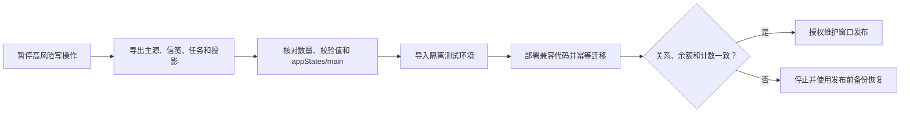

# 云数据库、索引、备份、恢复与迁移

本项目是固定两人使用的私人版，不是公共多租户服务。生产业务写入只能经过 `energyTree` 云函数；小程序端对所有集合的 `write` 必须为 `false`。仅 `coupleMessageInbox` 和 `coupleMessageStates` 为实时未读提供按可信 `auth.openid` 限定的客户端只读能力，其他集合对客户端关闭读写。

## 集合清单与真实数据源

| 类别 | 集合 | 用途 |
| --- | --- | --- |
| 业务主源 | `appStates` | `main` 文档保存版本化业务状态，是余额、关系、打卡、奖励和审计的恢复主源 |
| 业务投影 | `users`, `relationships`, `checkIns`, `rewardLedgers`, `claimRequests`, `rewardItems`, `redemptions`, `badges`, `badgeUnlocks`, `surpriseCards`, `encouragementCards`, `companionViewNotices`, `subscriptionGrants`, `auditLogs`, `rewardRules`, `growthTreeStates` | 与 `appStates/main` 同一事务更新的查询/运维投影；不得绕过主源单独修改 |
| 信笺主源 | `coupleMessages` | 情侣文字、单图、贴纸和请求消息 |
| 信笺投影 | `coupleMessageInbox`, `coupleMessageStates` | 双方收件投影和未读状态 |
| 迁移 | `coupleMessageMigrations` | 旧鼓励/查看提醒投影的幂等迁移标记 |
| 内容安全 | `mediaCheckTasks` | `traceId`、文件引用和异步处置状态；仅云函数读写 |

正式权限逐集合配置参照 [`cloud-database.rules.json`](cloud-database.rules.json)。该文件是评审基线；发布人员仍需在当前云开发控制台逐项核对实际规则，不得只凭仓库文件推断线上规则已经生效。

## 索引

发布前在云开发控制台核对下列索引。字段方向必须与代码查询一致；已有等价索引不要重复创建。

| 集合 | 字段与方向 | 级别 | 目的 |
| --- | --- | --- | --- |
| `coupleMessageInbox` | `recipientOpenid` 升序 + `sortKey` 降序 | 必需 | 分页读取当前用户最新信笺；解除收尾按关系与旧 recipientOpenid 撤销访问 |
| `coupleMessageStates` | `recipientOpenid` 升序 | 必需 | 未读 watcher 精确限定当前用户；解除后清空旧 recipientOpenid |
| `coupleMessageInbox` | `relationshipId` 升序 + `recipientOpenid` 升序 | `3.1.0` 必需 | 双方确认解除时分批撤销旧收件投影访问 |
| `coupleMessageStates` | `relationshipId` 升序 + `recipientOpenid` 升序 | `3.1.0` 必需 | 双方确认解除时撤销旧未读状态访问 |
| `mediaCheckTasks` | `traceId` 升序 | 必需 | `wxa_media_check` 回调按 traceId 定位唯一任务 |
| `mediaCheckTasks` | `relationshipId` 升序 + `status` 升序 | `3.1.0` 必需 | 发起和确认解除前阻止仍有 pending 图片任务的关系 |
| `mediaCheckTasks` | `status` 升序 + `createdAt` 升序 | 运维建议 | 查找超时 pending/orphan 任务，不参与在线业务判断 |
| `coupleMessages` | `relationshipId` 升序 + `sortKey` 降序 | 运维建议 | 关系内审计与恢复核对 |

`appStates/main` 与业务投影当前通过文档 ID 和内存状态处理，不需要擅自增加全表复合索引。索引创建失败或仍在构建时不得继续发布。

## 备份

备份是人工、受权操作；仓库脚本不会读取或导出现有云数据。

1. 记录待发布 commit、客户端 buildTag、云端 `queryDashboard.buildTag` 和 `appStates/main.state.version`，记录中不得包含 OPENID、邀请 token 或照片 URL。
2. 暂停两端业务操作，等待正在进行的审核、退款、核销和心愿金操作结束。
3. 使用云开发控制台的数据库导出功能，先导出 `appStates`，再导出四个信笺集合和 `mediaCheckTasks`，最后导出全部业务投影。
4. 单独导出云存储文件清单；备份副本应加密、限制访问，并使用不含用户姓名/OPENID 的目录名。
5. 记录每个集合的文档数量、导出时间和文件校验值。抽查 JSON 能解析、`appStates/main` 存在、消息和任务集合数量合理。
6. 将备份设为只读。不要把导出物、二维码、日志或照片提交到 Git。

## 恢复

1. 默认先恢复到隔离的测试云环境。未经明确停机和恢复授权，不在生产环境覆盖文档。
2. 部署与备份版本兼容的云函数依赖和代码；确认测试环境 buildTag 后再导入。
3. 先导入 `appStates`，再导入 `coupleMessages`、`coupleMessageInbox`、`coupleMessageStates`、`coupleMessageMigrations` 和 `mediaCheckTasks`，最后导入投影集合。
4. 恢复云存储对象时保持原 fileID/路径语义；无法保持时不得批量改写数据库引用，应停止并制定显式迁移。
5. 执行只读核对：双方登录、关系角色、余额三项、待审核数、信笺末条 sortKey、pending 内容安全任务数。
6. 执行一笔不涉及真实支付的测试打卡与退回，验证事务、幂等和快照同步。测试记录随后按正常业务保留或由授权人员处理，禁止直接清库。
7. 只有测试环境证据完整且获得生产恢复授权后，才能在维护窗口执行同样步骤。

## 版本迁移

当前 `appStates/main.state.version` 为 `4`（保持不变）。`3.1.0` 只增加向前兼容的 `relationship.lifecycleStatus` 与 `unbindRequest` 形状，不提升主状态版本；`ensureStateShape` 还会补全 revision、operation receipts、资料修改额度、鼓励卡和共同里程碑字段，不会清空既有数组。旧状态首次读取时默认关系为 `active`、解除申请为空。

迁移发布顺序：

1. 完成上述全量备份。
2. 在测试云环境导入备份副本并部署新云函数。
3. 连续两次调用只读查询，确认第二次不产生状态变化；连续两次用同一 `clientRequestId` 调用测试写动作，确认只记一次。
4. 对比迁移前后关系、余额、打卡、账本、心愿金、兑换和消息计数。
5. 再部署生产；首次读取完成后立即复核版本和计数。

不得回滚成会把版本 4 字段当作未知数据删除的旧代码。需要回滚时，优先回滚到兼容版本；必须恢复数据时使用发布前备份，并走完整恢复流程。
