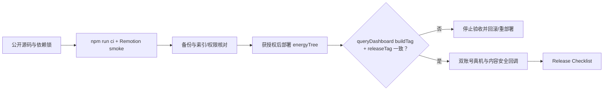

# 云端部署清单

## 线上 `3.0.0` 与 `3.1.0` 候选记录

| 项目 | 状态 |
| --- | --- |
| 线上 V3 | `3.0.0` 已于 2026-07-23 13:09:40 正式发布 |
| 线上兼容 buildTag | `heart-tree-private-v2-20260717-release-final-v1` |
| `3.1.0` 源码候选 | 已实现双方确认、两次警告的关系解除；等待公开 CI、隔离云环境双账号和真机验收 |
| `3.1.0` releaseTag | `heart-tree-private-v3-20260723-unbind-consent-v1` |
| 发布前备份与索引 | 2026-07-23 已完成 22 个集合清单、21 个非空 JSON、SHA-256、云存储根目录清单；3 个 `3.1.0` 必需复合索引已创建并刷新确认 |
| 候选云函数部署 | 2026-07-23 已使用“云端安装依赖（不上传 node_modules）”部署；模拟器真实查询通过 buildTag + releaseTag 校验 |
| 候选代码上传/审核/发布 | `3.1.0` 开发版本已于 2026-07-23 上传成功；提审与发布未执行 |

兼容 buildTag 中的 `v2` 是协议标识，继续保留可让已上线 `3.0.0` 使用向后兼容的新云函数。`3.1.0` 客户端还会校验 releaseTag；旧云函数缺少 releaseTag 时会失败关闭并提示重新部署。

## 部署前

- [ ] 工作区没有 `project.private.config.json`、OPENID、邀请 token、二维码、私人照片、导出数据或云端日志待提交。
- [ ] `npm ci --prefix cloudfunctions/energyTree --ignore-scripts` 与 `npm ls --prefix cloudfunctions/energyTree --omit=dev` 通过。
- [ ] `npm run ci`、`npm run motion:compositions`、`npm run motion:smoke` 全部通过。
- [ ] `npm run check:shared` 通过；`miniprogram/` 是共享业务主源，部署副本没有手改。
- [ ] 按 [`data-operations.md`](data-operations.md) 完成备份并记录匿名计数/校验值。
- [ ] 所有集合已创建；索引构建完成；[`cloud-database.rules.json`](cloud-database.rules.json) 与线上规则逐项一致，所有客户端写权限均为 false。
- [ ] 微信公众平台已将 `wxa_media_check` 路由到 `energyTree`。
- [ ] 使用隔离测试云环境和虚构关系完成双方解除；不要在现有线上私人关系执行最终解除。

## 微信开发者工具

1. 导入仓库根目录，确认使用公开 `project.config.json`；本地私有覆盖只能保存在被忽略文件中。
2. 点击“编译”，记录工具版本、基础库版本、Problems/Errors/Warnings 数量和脱敏截图。
3. 右键 `cloudfunctions/energyTree`，选择“上传并部署：云端安装依赖（不上传 node_modules）”。部署是外部写操作，仅在获得环境所有者授权后执行。
4. 部署完成后重新编译，真实调用 `queryDashboard`；只记录响应 buildTag、releaseTag 和成功/失败，不记录 data、OPENID 或临时 URL。
5. 客户端 [`miniprogram/config/env.js`](../miniprogram/config/env.js) 与云端响应 buildTag、releaseTag 必须完全一致。客户端启动日志不能作为云端证据。
6. 连续使用相同 `clientRequestId` 执行获授权的测试写动作，确认只产生一次业务变化。
7. 在隔离测试环境完成“账号 A 两次警告发起 → A 不能确认 → A 可撤回 → 再次发起 → 账号 B 两次警告确认 → 双方访问失效 → 旧邀请不能复用”，并核对历史主源未被删除。

## 发布后

- [ ] 两个既有测试账号完成 [`device-acceptance.md`](device-acceptance.md)，不重建关系、不清库。
- [ ] 合法文字/图片不过度拦截；合规风险测试素材能触发隐藏闭环；重复回调幂等。
- [ ] 抽查余额、冻结余额、已兑现、待审核、待退款和信笺未读计数与发布前一致。
- [ ] 检查 `mediaCheckTasks` 没有异常增长的 pending；检查云函数错误日志仅包含脱敏元数据。
- [ ] 抽查线上 `3.0.0` 在候选云函数部署后仍可正常查询与写入，确认兼容窗口没有中断。
- [ ] 完成 [`release-checklist.md`](release-checklist.md) 并记录发布负责人、commit、buildTag 和回滚点。

若缺少合法登录、云环境权限、两个微信账号或平台配置权限，停止对应步骤并把它标记为“未执行/外部权限阻塞”；不得用本地单测、web-demo 或模拟器截图替代。
