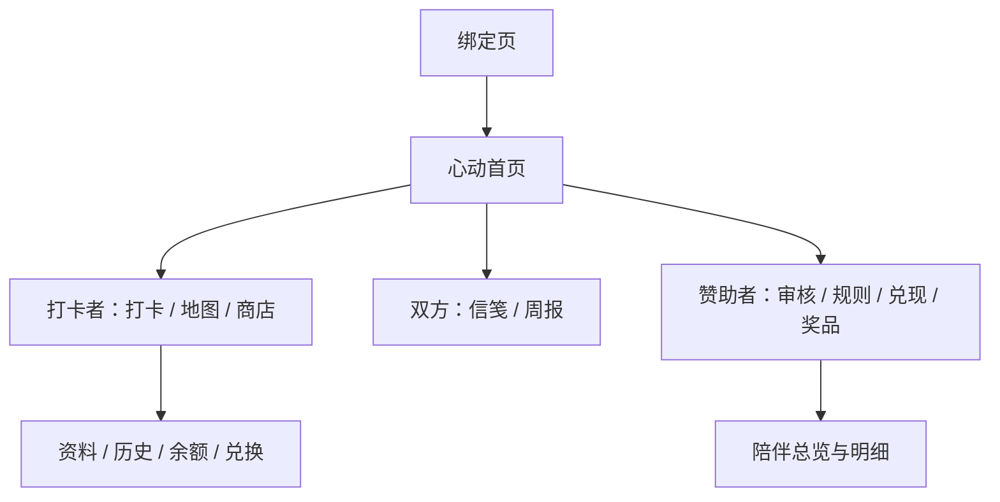

# 22 个小程序页面目录

本目录以 `miniprogram/app.json` 为可信来源，覆盖当前全部 22 个页面。它帮助产品、设计、测试和部署人员快速确认“谁能看、从哪里进入、页面负责什么、失败时应保留什么边界”。

> 下方截图来自微信开发者工具 iPhone 12/13 模拟器，只使用虚构演示数据，是界面说明而非双账号真机验收证据。截图不包含真实 OPENID、邀请 token、二维码、头像、信笺或私人照片。

## 主要角色路径

## 新增页面画廊

| 情侣信笺 | 每周回顾 | 心愿金领取 | 兑换记录 |
| --- | --- | --- | --- |
|  |  |  |  |

| 打卡审核 | 奖励与地图规则 | 心愿金处理 | 奖品管理 |
| --- | --- | --- | --- |
|  |  |  |  |

## 页面清单

| 路由 | 角色 | 主要入口 | 页面职责与数据边界 |
| --- | --- | --- | --- |
| `pages/home/home` | 双方 | 默认首页 / 心动 Tab | 按角色聚合今日状态、共同成长、待办和入口；只展示云端授权返回的数据 |
| `pages/bind/bind` | 未绑定用户 | 启动重定向 / 邀请分享 | 创建固定两人关系或消费一次性邀请；客户端不能指定可信 OPENID |
| `pages/adventure-map/adventure-map` | 双方 | 足迹 Tab | 展示审核通过后的地图步数和关卡，不直接改写进度 |
| `pages/shop/shop` | 双方 | 礼物 Tab | 浏览有效奖品与余额；兑换仍由云端事务完成 |
| `pages/messages/messages` | 双方 | 信笺 Tab | 文字、授权图片、贴纸和请求卡；临时图片 URL 只在关系鉴权后签发 |
| `pages/profile/profile` | 双方 | 我们 Tab | 资料、统计、偏好设置和角色对应的管理入口 |
| `pages/profile-edit/profile-edit` | 双方 | 我的资料 | 修改昵称、头像和徽章；上传失败时清理未被引用的新文件 |
| `pages/checkin/checkin` | 打卡者 | 首页打卡按钮 / 地图提醒 | 上传运动凭证并提交待审核记录；提交不直接入账 |
| `pages/wallet/wallet` | 打卡者 | 首页 / 我们 | 查看能量币和心愿金状态，发起线下手动兑现申请 |
| `pages/history/history` | 打卡者 | 我们 / 周报 | 查看自己的历史打卡和审核结果，不扩大照片访问范围 |
| `pages/reward-detail/reward-detail` | 打卡者 | 商店奖品卡 | 展示单个奖品、余额和兑换确认，不允许客户端计算最终扣款 |
| `pages/redemptions/redemptions` | 双方 | 商店 / 我们 | 展示兑换券、核销与取消退款状态；高风险动作需要二次确认 |
| `pages/sponsor-companion/sponsor-companion` | 赞助者 | 首页 / 我们 | 汇总对方授权范围内的进度、鼓励和待办 |
| `pages/sponsor-companion-history/sponsor-companion-history` | 赞助者 | 陪伴总览 | 查看打卡历史；跨账号访问必须经过关系和角色鉴权 |
| `pages/sponsor-companion-badges/sponsor-companion-badges` | 赞助者 | 陪伴总览 | 查看对方徽章和成长成果，不提供修改入口 |
| `pages/sponsor-companion-ledgers/sponsor-companion-ledgers` | 赞助者 | 陪伴总览 | 查看能量币账本摘要，不允许直接调整余额 |
| `pages/sponsor-companion-redemptions/sponsor-companion-redemptions` | 赞助者 | 陪伴总览 | 查看对方兑换记录并进入授权处理流程 |
| `pages/admin-rewards/admin-rewards` | 赞助者 | 首页 / 我们 | 新增、编辑、上下架奖品；已有引用的奖品删除时转为停用 |
| `pages/sponsor-review/sponsor-review` | 赞助者 | 首页待办 | 审核或退回打卡；通过时事务完成入账、地图和徽章更新 |
| `pages/sponsor-rules/sponsor-rules` | 赞助者 | 首页 / 审核台 | 设置固定奖励、每日上限、连续奖励和地图关卡，不提供随机现金抽奖 |
| `pages/sponsor-payouts/sponsor-payouts` | 赞助者 | 首页待办 | 审批心愿金申请并在线下兑现后标记；不调用微信支付或自动转账 |
| `pages/weekly-recap/weekly-recap` | 双方 | 首页周报卡 | 按中国时区汇总一周进展，不在周报中复制打卡照片 |

## 页面状态约定

| 状态 | 最低要求 |
| --- | --- |
| Loading | 明确说明正在获取什么，不能闪现上一个账号的数据 |
| Empty | 空审核、空兑换、空历史和空信笺分别使用对应语义 |
| Error | 显示可理解的错误和重试入口，不暴露 OPENID、文件 URL 或堆栈 |
| Weak network | 写操作保持进行中锁，相同 `clientRequestId` 重试不得重复入账 |
| Permission limited | 解释相册/相机授权用途；撤回后停止新上传但不破坏文字数据 |

真机状态、键盘弹起、弱网和双账号路径仍以 [真机验收表](device-acceptance.md) 为准。
