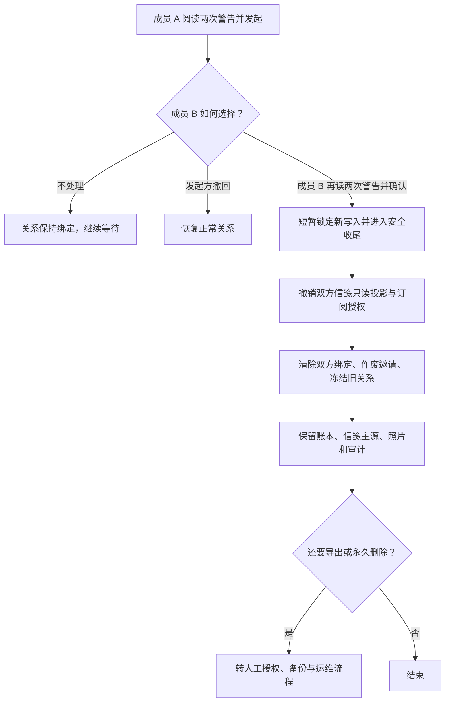
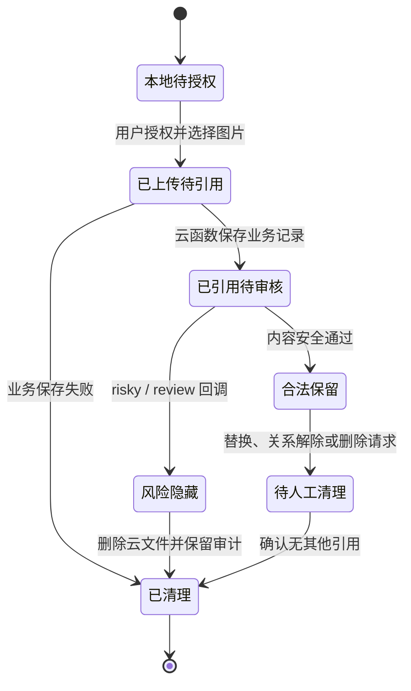

# 关系解除、数据权利、照片生命周期与账号恢复

本文描述私人版 V3 / 小程序 `3.1.0` 候选版的数据边界。“保留历史数据并解除访问”已经提供小程序内入口，但双方都要完成两次确认，并分别阅读两次警告；任何一方都不能单独解除。数据导出、永久删除和异常账号恢复仍是人工高风险流程，不能把关系解除误解为自动删除账号或清空数据。

## 解绑与关系解除

1. 任一已绑定成员可在“我的 → 关系与隐私”发起申请。服务端只接受 `getWXContext().OPENID` 对应的可信成员身份，不接受客户端传入的角色、OPENID 或关系标识代替鉴权。
2. 发起前必须连续通过两次不同警告。若有待审核打卡、冻结心愿金、待处理心愿金或待核销/取消兑换，云端拒绝发起；pending 图片内容安全任务不再阻断解除，旧图片引用会随冻结关系保留，后续回调仍按 traceId 隐藏、审计或删除风险内容。
3. 申请进入 `pending` 后只记录待确认状态，不改变当前绑定或正常功能，避免任一方通过单方发起锁住另一方；发起方可在另一方确认前撤回，另一方不能替发起方撤回。
4. 另一方进入同一页面后，同样需要连续通过两次警告。服务端再次核对确认者不是发起者、关系仍然有效、没有新增待处理事项，并以幂等请求记录确认。
5. 云端先将申请标记为 `releasing`，再撤销 `coupleMessageInbox` 和 `coupleMessageStates` 中双方 `recipientOpenid`，最后完成冻结。网络中断时关系停留在安全收尾状态，由确认方重试；不会回到可单方撤回或继续写业务的状态。
6. 完成后清空关系与两个用户记录中的绑定 OPENID，作废旧邀请，撤销订阅授权，停止实时 watcher，并将关系标记为 `frozen`。旧绑定页只显示冻结说明，不能将旧关系重新绑定给新账号。
7. 解除不会自动删除账本、打卡、奖励、信笺主源、照片或审计，也不会触发支付、退款或转账。需要导出或永久删除时继续走下文的人工流程。

关系解除不是把私人版改造成公共多租户的入口。新关系应使用独立、经过确认的数据环境或明确的新初始化流程，不能复用旧关系主文档。

## 数据导出

导出包至少包含：资料文本、关系信息、打卡元数据、账本、心愿金、兑换、奖励规则、成就、共同里程碑、信笺、内容安全任务状态和审计记录。照片与信笺图片作为单独文件目录，并用不含 OPENID 的内部编号关联。

- 导出前说明时间范围、是否包含双方信笺、是否包含图片原文件。
- 默认移除 OPENID、邀请 token、临时 URL、平台回调原文和内部错误日志。
- 输出包加密，密码通过不同渠道交付；设置交付后删除期限。
- 不把导出包放进仓库、CI artifact、公共网盘或真机验收截图。

## 数据删除

删除是不可逆的外部操作，执行前必须有明确授权、备份策略和两人共同数据范围说明。

1. 先冻结关系并再次列出将删除的集合文档和云存储对象数量。
2. 删除云存储中的头像、打卡图、奖品图和信笺图；失败项进入重试清单。
3. 删除信笺主记录、双方 inbox/state/migration 投影和内容安全任务。
4. 删除业务投影，最后删除 `appStates/main` 中对应关系数据；私人单关系环境需要删除整个主文档时必须再次确认不会影响其他数据。
5. 保留法律或安全所必需的最小删除证明时，只保留时间、执行人和匿名计数，不保留内容或 OPENID。
6. 复查临时备份、导出包和本地验收素材的到期删除。

仓库代码不会自动执行上述删除，也不得为了测试清空现有云数据。

## 照片生命周期

1. 客户端获得隐私授权后，将图片上传到当前关系和用途限定的云存储路径。
2. 新上传文件如果业务保存失败，客户端尽力删除；不能掩盖原始业务错误。
3. 云函数用可信 OPENID、关系路径和内容安全服务验证引用。业务响应仅返回短期临时 URL，不持久化公开 URL。
4. `mediaCheckAsync` pending 期间图片可能暂时显示；风险/复审回调会清空引用、隐藏内容、写审计并尽力删除原文件。
5. 用户更换头像/奖品图后，旧文件只有确认不再被任何记录引用才能删除；共享或历史引用不明确时保留并进入人工清理清单。
6. 关系解除或删除请求按上节处理。没有授权的定时清理任务不得扫描和删除私人照片。

## 撤回隐私授权

用户可在微信的小程序权限/隐私设置中撤回照片相关授权。撤回后：

- 新的相机/相册选择必须停止，并给出重新授权说明；不得反复弹窗诱导授权。
- 已上传数据不会因为系统授权撤回而自动删除。界面需说明可另行申请导出或删除。
- 文字、账本和只读历史在不需要照片权限时仍应可用；图片上传失败不得导致余额或审核状态被误改。
- 恢复授权后仅恢复后续上传能力，不自动重新上传本地照片。

## 异常账号恢复

微信账号丢失或更换时，客户端不能提交新的 OPENID 来接管旧角色。恢复流程必须由云环境所有者人工完成：

1. 冻结高风险动作并备份。
2. 通过已知渠道核验旧账号持有人、另一位关系成员和待恢复角色；邀请 token 或二维码不足以证明所有权。
3. 检查旧账号是否仍可登录；可登录时优先由旧账号确认迁移。
4. 在受控脚本/控制台操作中只替换目标角色绑定，保持 user id、关系、账本和审计不变，并追加账号恢复审计。
5. 轮换全部邀请 token，重新部署/查询 buildTag，使用两个账号复核角色权限和历史可见性。
6. 任一身份核验不充分时停止恢复，不创建“临时管理员”或客户端越权后门。

所有心愿金和奖励仍是内部记账与线下手动兑现；账号恢复不得触发微信支付、转账或金融产品式承诺。
