# 心动能量树产品导览

这份导览面向第一次接触项目的人。它解释产品解决什么问题、两个角色怎样协作、每个主要页面为什么存在，以及自动化测试能够证明什么、不能证明什么。

> 所有截图使用虚构资料。仓库不保存真实 OPENID、邀请 token、二维码、聊天内容或私人照片。

## 一分钟理解产品

心动能量树把一段两人关系拆成三个简单动作：

1. 打卡者完成一件真实行动并提交记录。
2. 赞助者确认行动、给出反馈，并在线下履行承诺。
3. 系统把双方共同确认的结果呈现为树木成长、地图前进、徽章和周报。

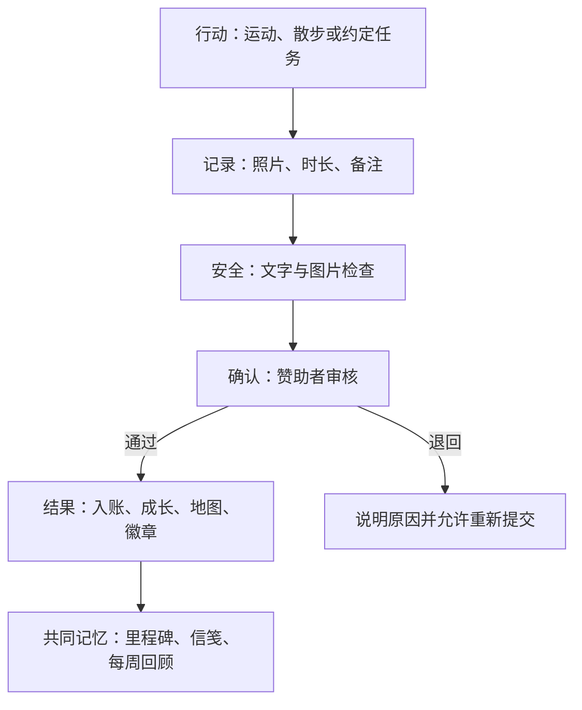

## 角色一：打卡者

打卡者看到的是“今天要做什么、完成后发生了什么”。提交并不会直接产生余额；只有赞助者审核通过后，奖励、地图进度和徽章才会在同一事务里生效。

| 首页总览 | 提交打卡 |
| --- | --- |
|  |  |

### 首页承担的职责

- 展示双方身份、今日状态和当前能量树等级。
- 把“打卡、地图、商店、周报”组织成一条清晰路径。
- 展示未读鼓励和共同里程碑，但避免连续弹窗打断。
- 对云端加载失败提供错误说明和重试入口。

### 打卡页承担的职责

- 先完成相册/相机隐私授权，再上传照片。
- 只提交当前关系目录下的云文件 ID，不能提交任意路径。
- 文字与图片先经过微信内容安全服务。
- 提交按钮有进行中锁，同一个 `clientRequestId` 不会重复创建记录。
- 保存失败时清理本次新上传、且尚未被业务引用的文件。

## 共同成长：地图与能量树

地图把长期目标拆成多个关卡；能量树把累计结果转成更柔和的视觉反馈。它们都只消费已经审核通过的记录。

| 探险地图 | 奖励商店 |
| --- | --- |
|  |  |

### 五个成长阶段

| 阶段 | 视觉 | 含义 |
| --- | --- | --- |
| 1 · 破土 |  | 关系刚建立，先完成第一件小事 |
| 2 · 发芽 |  | 形成最初的连续记录 |
| 3 · 成长 |  | 多个行动开始积累成稳定节奏 |
| 4 · 盛放 |  | 共同目标和奖励体系逐渐完整 |
| 5 · 心愿花园 |  | 长期陪伴留下可回顾的共同成果 |

树的等级是展示模型，不是金融等级，也不代表收益、利息或资产价值。

## 角色二：赞助者

赞助者首页强调“待处理事项”，而不是展示一个复杂后台。审核、规则、奖品、退款和心愿金处理都受可信 OPENID 与角色鉴权保护。

赞助者的高风险入口拆成四个页面，每个页面只承担一种主要责任：

| 打卡审核 | 奖励与地图规则 | 心愿金处理 | 奖品管理 |
| --- | --- | --- | --- |
| 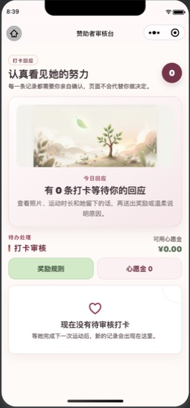 | 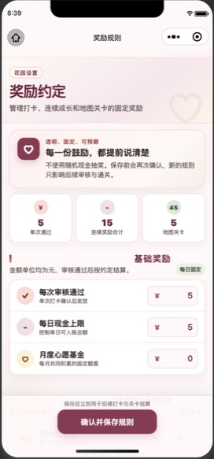 | 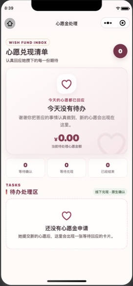 | 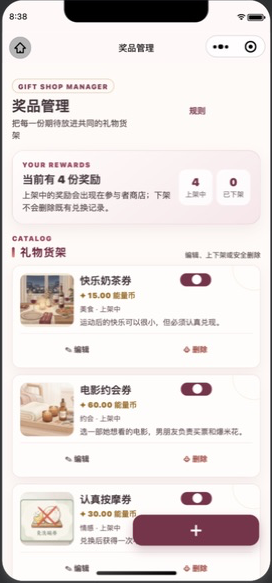 |

- 审核台只处理待审核打卡，空状态不会伪造待办。
- 规则页显示固定奖励、每日上限和地图关卡，不提供随机现金抽奖。
- 心愿金页只记录审批和手动兑现，不调用平台付款。
- 奖品页允许上下架；存在历史引用的奖品不能被破坏性删除。

赞助者可以：

- 审核或退回打卡，并填写清晰备注。
- 调整单次奖励、每日上限、地图关卡和连续奖励。
- 新增、停用或删除没有历史引用的奖品。
- 核销兑换券，或者确认/拒绝取消退款。
- 在线下完成承诺后，把心愿金申请标记为“已手动兑现”。
- 发送鼓励卡，查看对方授权范围内的陪伴数据。

赞助者不能：

- 伪造打卡者身份或替对方提交记录。
- 直接修改客户端余额、审核状态或数据库文档。
- 触发微信支付、自动转账、充值或金融收益。

## 奖励不是支付

商店中的内容更接近“两个人约定好的兑换清单”。默认示例刻意使用陪伴和生活场景，而不是现金产品。

| 约会体验 | 日常照顾 | 小礼物 | 情绪支持 |
| --- | --- | --- | --- |
|  |  |  |  |

| 心愿金领取 | 兑换记录 |
| --- | --- |
| 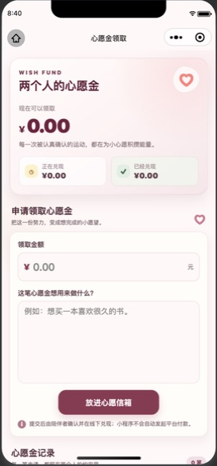 | 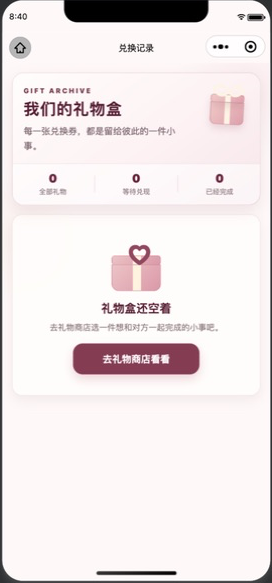 |

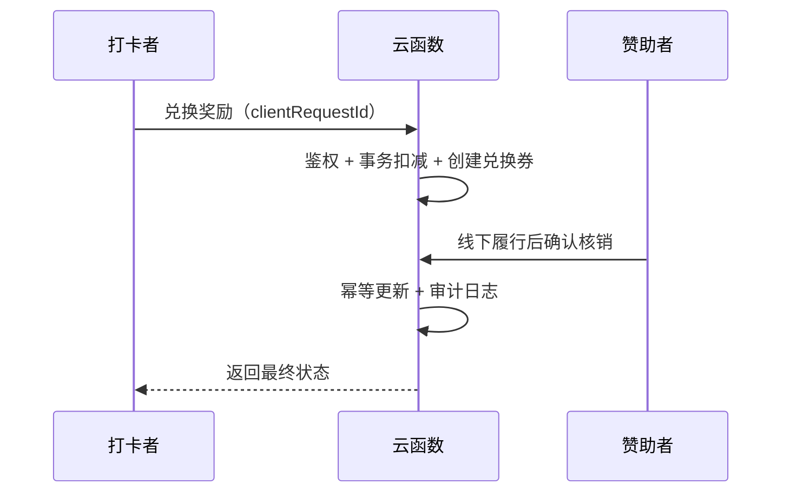

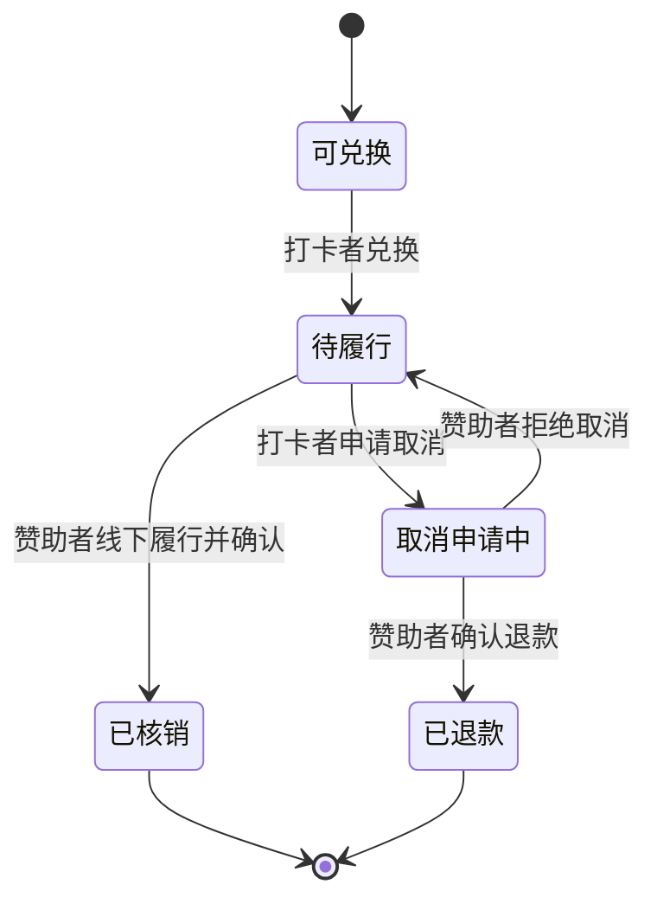

## 情侣信笺与请求卡

信笺页支持文字、授权图片、贴纸和双向请求卡。请求卡表达的是一次邀请，不代表同意；接收方可以同意、稍后、婉拒，发送方也可以在未处理前撤回。

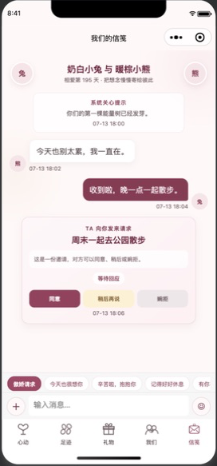

安全边界包括：

- 当前用户身份来自云函数 `OPENID`，不能从客户端指定。
- 图片只能来自当前关系和发送方限定的云存储目录。
- 文字和图片都进入内容安全检查。
- 双方各自拥有未读投影，标记已读不会修改对方状态。
- 临时图片 URL 只在关系鉴权后签发，不持久化为公共 URL。

## 每周回顾

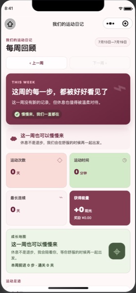

每周回顾按中国时区的周一到周日统计：

- 通过的打卡天数和运动时长。
- 本周获得的能量币、地图步数和解锁徽章。
- 鼓励、兑换、心愿金和共同里程碑摘要。
- 一句不暴露照片内容的温柔总结。

周报不会嵌入打卡照片，避免在摘要页面扩大私人图片的暴露面。

## 13 个动效场景

Remotion 工厂为关键反馈生成本地 poster；远程 MP4 只是可选增强层。

| 绑定 | 打卡 | 审核 | 鼓励 |
| --- | --- | --- | --- |
|  |  |  |  |

| 连续 3 天 | 连续 7 天 | 连续 14 天 | 地图通关 |
| --- | --- | --- | --- |
|  |  |  |  |

| 徽章 | 兑换 | 心愿完成 | 周报 | 空陪伴状态 |
| --- | --- | --- | --- | --- |
|  |  |  |  |  |

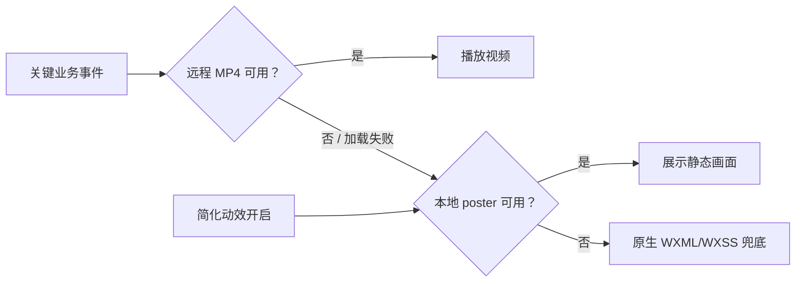

声音同样是可选反馈：用户可以关闭并持久化设置，播放时遵循系统静音开关。

## 加载、错误和弱网设计

| 状态 | 用户看到什么 | 工程约束 |
| --- | --- | --- |
| Loading | 骨架或明确的加载提示 | 不显示旧账号或伪造数据 |
| Empty | 与当前页面语义对应的空状态 | 空历史、空奖品、空审核分别表达 |
| Error | 有边界的错误说明和重试操作 | 日志只记录动作和脱敏错误元数据 |
| Weak network | 按钮保持进行中锁，可安全重试 | 相同请求 ID 不重复入账或核销 |
| Permission limited | 说明需要的相册/相机权限 | 撤回授权后停止上传，不影响已有文字记录 |

这些状态有自动化契约测试，但窄屏、键盘弹起和弱网体验仍需按照 [真机验收表](device-acceptance.md) 在微信环境验证。

## 自动化能够证明什么

当前测试覆盖业务规则、角色权限、并发事务、幂等、内容安全模拟、共享代码同步、UI 契约、包体预算和 Remotion 真渲染。

自动化不能替代：

- 微信云环境中的真实 buildTag 响应。
- `wxa_media_check` 平台事件路由。
- 两个合法微信账号的真机协作。
- 真实相册/相机授权、弱网和键盘行为。
- 发布前备份、线上规则和索引核对。

对应人工步骤见 [部署清单](deployment-checklist.md)、[真机验收表](device-acceptance.md) 和 [Release Checklist](release-checklist.md)。

## 继续阅读

- [视觉与动效设计说明](visual-language.md)
- [系统架构](architecture.md)
- [内容安全闭环](content-safety-closed-loop.md)
- [数据库与迁移](data-operations.md)
- [隐私与数据生命周期](privacy-data-lifecycle.md)
