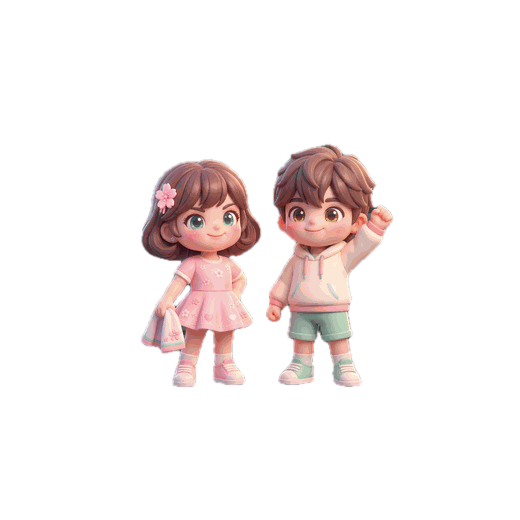
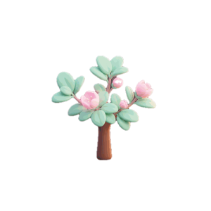
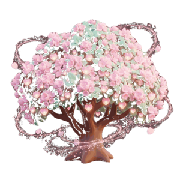
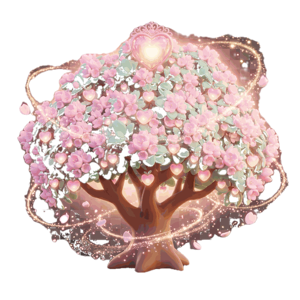
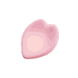
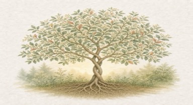
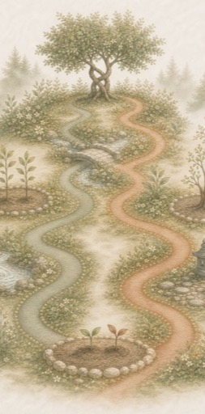
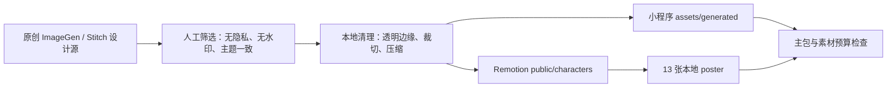

# 视觉与动效设计说明

心动能量树的视觉目标不是“把所有东西都做成粉色”，而是让一套涉及审核、账本和隐私的功能仍然显得温柔、可信、适合长期使用。

## 设计原则

### 1. 成长感，而不是催促感

进度通过树木、花园、地图和共同回顾呈现。界面避免使用倒计时、排行榜、损失厌恶和强刺激红点来迫使用户行动。

### 2. 浪漫感服从可读性

装饰使用纸张、植物、丝带和古金色，但正文保持足够对比度；小字号不低于当前约定的 20rpx，交互区域不低于 88rpx。

### 3. 庆祝只出现在关键时刻

普通点击不播放大型动效。绑定、首次打卡、审核通过、连续记录、地图通关、徽章、兑换和心愿完成才触发庆祝层。

### 4. 私人数据不成为装饰素材

周报、README、测试和发布证据都不使用真实照片。跨账号图片只有在关系鉴权后才能获得临时 URL。

## 核心色彩

| 语义 | 参考值 | 用途 |
| --- | --- | --- |
| Ivory / Cream | `#FBF7EF` | 页面背景、留白和安静区域 |
| Pearl | `#FFFDF8` | 卡片与输入表面 |
| Sage | `#748276` | 植物、成长和低刺激成功反馈 |
| Forest | `#294139` | 高对比标题和主要结构 |
| Dusty Rose | `#A85570` | 关系与情感强调 |
| Burgundy | `#6D2942` | 主要操作、仪式感和高权重文案 |
| Antique Gold | `#92743E` | 徽章、里程碑和少量装饰 |
| Midnight | `#111A2D` | 深色庆祝场景 |
| Ink | `#302D2A` | 正文 |
| Muted Ink | `#6D6862` | 次级说明，仍需满足可读性 |

实际小程序样式以 WXSS 为准；Figma 文件用于视觉协作，不能覆盖已经上线的可信业务规则。

## 角色插画

熊和兔子是成年化、非真人的关系角色，避免把任何真实用户外貌固化进产品资产。

| 相守 | 出发 | 庆祝 |
| --- | --- | --- |
|  |  |  |

## 成长资产

五阶段树木使用一致的盆器、树冠轮廓和光照方向，使成长看起来是同一棵树持续变化，而不是五张无关插画。

| L1 | L2 | L3 | L4 | L5 |
| --- | --- | --- | --- | --- |
|  |  |  |  |  |

## 粒子与庆祝符号

| 爱心 | 花瓣 | 星光 | 奖励币 |
| --- | --- | --- | --- |
|  |  |  |  |

粒子只负责短暂反馈，不传达真实货币、收益或投资含义。

## 页面场景素材

Stitch 原始页面层级被保留为实现基线，并转换为原生 WXML/WXSS，而不是在小程序运行时嵌入网页。

| 打卡场景 | 花园场景 | 地图场景 | 兑换场景 |
| --- | --- | --- | --- |
|  |  |  |  |

## 素材生产链

原始生成源保存在 `design/imagegen-source/`，运行时素材保存在 `miniprogram/assets/`。生成缓存和 Remotion `out/` 不进入 Git。

## 动效分级

| 等级 | 时长建议 | 用途 | reduced-motion |
| --- | --- | --- | --- |
| L1 | 90–160ms | 按压、切换和轻量反馈 | 直接更新状态 |
| L2 | 180–280ms | 卡片进入、内容展开 | 缩短或取消位移 |
| L3 | 220–600ms | 树木成长、徽章、兑换 | 使用静态 poster |
| L4 | 3–4s | 少量关键仪式视频 | 跳过 MP4，保留 poster |

任何场景都不能把视频作为唯一信息载体。视频失败必须回到 poster，poster 失败必须回到原生静止可读状态。

## 声音策略

项目只包含三种短音效：轻提示、成长反馈和承诺完成。声音默认遵循系统静音，用户关闭后持久保存；声音关闭不影响任何业务操作。

## 响应式与可访问性

- 全局盒模型限制横向溢出。
- 320/360px 等效窄屏具有明确回退布局。
- 原生按钮和 `role="button"` 交互区域统一不低于 88rpx。
- 输入区跟随键盘高度，不用固定视口减法猜测设备尺寸。
- 浅色次级文案使用经过收紧的深色 token。
- “简化动效”开关同时影响视频、庆祝层和循环动画。
- 所有远程数据页面都必须具备 loading、empty、error 和 retry 状态。

## Figma 当前边界

仓库记录的 Figma 文件包含 3 个物理页面、5 个变量集合、61 个变量、83 个组件根、8 个文字样式和 3 个效果样式。只读审计仍发现：

- 变量 scope 需要从 `ALL_SCOPES` 细化。
- 变量尚缺少 code syntax 映射。
- responsive/motion 交付区仍未完整写入。

因此 Figma 是待继续完善的设计协作源，不应被描述为已经完成的最终验收。对应可复现脚本位于 `design/figma/scripts/`。

## 本次 README 封面

`docs/illustrations/heart-tree-readme-hero.jpg` 由内置 ImageGen 生成，提示目标为：宽幅私人花园、心形五阶段树、成年化熊兔情侣、象牙/鼠尾草/酒红/古金配色；明确排除文字、二维码、支付标识、真人和水印。PNG 原始结果经过本地 JPEG 压缩后进入仓库，不进入小程序主包。

## 验收入口

- UI 契约与素材质量：`npm test`
- 主包和素材预算：`npm run check:budgets`
- Remotion 场景发现：`npm run motion:compositions`
- Remotion 真实渲染：`npm run motion:smoke`
- 真机窄屏、键盘、弱网和 reduced-motion：[device-acceptance.md](device-acceptance.md)
